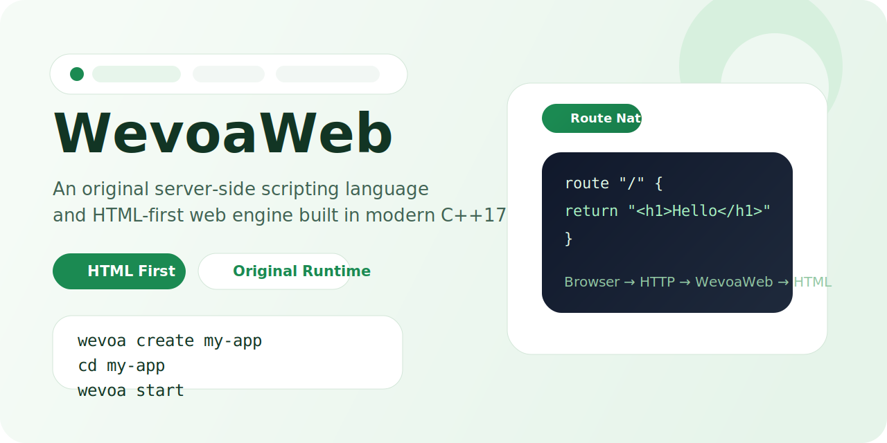

<p align="center">
  
</p>

<p align="center">
  <a href="https://github.com/AHADBAVA/Wevoa-Web/actions/workflows/ci.yml"></a>
  <a href="LICENSE"></a>
  
  
</p>

<p align="center">
  An original server-side scripting language and HTML-first web engine built in modern C++17.
</p>

WevoaWeb combines a small programming language, a tree-walk interpreter, a built-in HTTP dev server, and a CLI for creating and running server-rendered apps. The browser receives plain HTML and static assets only.

## Why It Stands Out

- Original implementation from lexer to server runtime
- HTML-first web model with native `route` declarations
- Lightweight codebase that is easy to read and extend
- Modern C++17 architecture with clear language layers
- Built-in developer workflow with `wevoa start` and `wevoa create`

## Quick Start

Build:

```powershell
g++ -std=c++17 -Wall -Wextra -pedantic -I. main.cpp `
    cli/cli_handler.cpp `
    cli/project_creator.cpp `
    lexer/lexer.cpp parser/parser.cpp ast/ast.cpp `
    interpreter/value.cpp interpreter/environment.cpp `
    interpreter/callable.cpp interpreter/interpreter.cpp interpreter/route.cpp `
    runtime/builtins.cpp runtime/ast_printer.cpp runtime/session.cpp `
    server/http_types.cpp server/web_app.cpp server/http_server.cpp server/dev_server.cpp `
    watcher/file_watcher.cpp `
    utils/logger.cpp utils/keyboard.cpp utils/file_writer.cpp `
    -o wevoa.exe -lws2_32
```

Create and run an app:

```powershell
.\wevoa.exe create my-app
cd .\my-app
..\wevoa.exe start
```

Open:

```text
http://localhost:3000
```

## Language Snapshot

```text
let title = "WevoaWeb"

func welcome(name) {
return "<h1>Hello " + name + "</h1>"
}

route "/" {
return welcome(title)
}
```

Current language features:

- `let` and `const`
- integers, strings, booleans, and `nil`
- arithmetic and comparisons
- blocks, `if / else`, and `loop`
- functions, `return`, and lexical closures
- built-in `print()` and `input()`
- source-aware lexer, parser, and runtime diagnostics

## Runtime Flow

<p align="center">
  
</p>

## What You Get In This Repo

- `lexer/`, `parser/`, `ast/`, `interpreter/`, and `runtime/`
- `server/` for route loading, HTTP handling, and static assets
- `cli/` for `start`, `create`, `build`, and `help`
- `watcher/` for development reload support
- `examples/` and demo routes under `views/`
- open-source repo standards, templates, and contributor docs

## Documentation

- [Quick Start](docs/quickstart.md)
- [Language Reference](docs/language-reference.md)
- [Architecture](docs/architecture.md)
- [Roadmap](ROADMAP.md)
- [Changelog](CHANGELOG.md)
- [Contributing](CONTRIBUTING.md)
- [Support](SUPPORT.md)

## Current Status

WevoaWeb is working and public, but still intentionally small. The current implementation already supports:

- an original interpreted language
- server-side HTML rendering
- route-based web apps
- static file serving from `public/`
- file watching and manual reload controls
- project scaffolding with a clean starter template

The current limitations are:

- no module/import system yet
- no arrays, maps, or object literals yet
- no floating-point numbers yet
- no classes or methods yet
- no production build pipeline yet
- no full template/layout engine yet

## Open Source

- [MIT License](LICENSE)
- [Code of Conduct](CODE_OF_CONDUCT.md)
- [Security Policy](SECURITY.md)
- [Issue Templates](.github/ISSUE_TEMPLATE)
- [Pull Request Template](.github/pull_request_template.md)

## Roadmap Direction

Planned areas of growth include:

- bytecode VM work
- stronger standard library primitives
- better templating and route ergonomics
- config-driven server behavior
- improved testing and diagnostics

See the full plan in [ROADMAP.md](ROADMAP.md).
