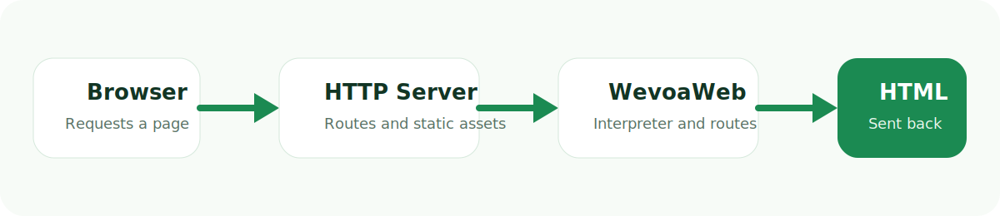

<p align="center">
  
</p>

<h1 align="center">WevoaWeb</h1>

<p align="center">
  An original server-first scripting language, runtime, and HTML-first web framework built in modern C++17.
</p>

<p align="center">
  
  
  
  
</p>

WevoaWeb combines a custom language, interpreter, template engine, HTTP server, package system, starter packs, and CLI into one installable platform. It is designed for developers who want a simpler server-rendered stack with fewer moving parts and no JavaScript dependency for the normal request flow.

## Why WevoaWeb

- One runtime for language, routing, templates, build, serve, and project scaffolding
- Server-first HTML model with layouts, includes, components, and template control flow
- Clean request lifecycle with sessions, CSRF, middleware, JSON helpers, and SQLite support
- Package ecosystem with official core packages: `@auth`, `@db`, and `@utils`
- Two official starter packs: `app` and `dashboard`
- Single-binary distribution path with Windows installer support

## Quick Start

If the runtime is already installed globally:

```text
wevoa --version
wevoa create dashboard app
cd app
wevoa start
```

Open:

```text
http://localhost:786
```

What each step does:

- `wevoa --version` confirms the runtime is installed and available on `PATH`
- `wevoa create dashboard app` generates the official dashboard starter
- `cd app` moves into the generated project folder
- `wevoa start` launches the development server

## Install

### Windows: recommended

The recommended Windows distribution path is the GUI installer:

- `dist\installer\WevoaSetup.exe`

That installs the runtime globally, adds it to `PATH`, and makes `wevoa` available from any new terminal.

### Windows: build from source

```powershell
.\scripts\build-release.ps1
.\scripts\install-wevoa.ps1
```

### Linux: build from source

```bash
./scripts/build-release.sh
./scripts/install-wevoa.sh
```

Default install targets:

- Windows: `%USERPROFILE%\bin\wevoa.exe`
- Linux: `/usr/local/bin/wevoa` when writable, otherwise `$HOME/.local/bin/wevoa`

## Starter Packs

WevoaWeb now ships with two official built-in starters.

### `app`

The default starter for a clean minimal project:

```text
wevoa create my-app
```

Includes:

- one route
- one layout
- one view
- basic config
- minimal UI

### `dashboard`

A more complete real-world starter:

```text
wevoa create dashboard admin-panel
```

Includes:

- account creation and sign-in flow
- protected dashboard route
- task CRUD example
- package-backed auth and database helpers
- polished server-rendered UI

## What the Platform Already Supports

### Language

- `let`, `const`, `func`, `route`, `component`, `import`
- integers, strings, booleans, arrays, objects, and `nil`
- `if / else`, `loop`, `while`, `break`, and `continue`
- lexical scoping and closures
- indexing, property access, `&&`, `||`, and normal expression evaluation

### Templates

- file-based `.wev` views
- `{{ expression }}` interpolation
- ``, ``, ``, ``
- `extend`, `section`, and `include`
- reusable components
- compiled template and fragment caching

### Framework

- `GET`, `POST`, `PUT`, `PATCH`, `DELETE`
- dynamic route params like `:id`
- route middleware
- structured request helpers
- response helpers with `json()`, `redirect()`, and `status()`
- cookie-backed sessions and CSRF protection
- multipart uploads and static file serving

### Data

- built-in SQLite integration
- migrations with `wevoa migrate`
- per-worker database strategy with WAL mode
- official `@db` package helpers

### Platform and CLI

- `wevoa create`
- `wevoa start`
- `wevoa build`
- `wevoa serve`
- `wevoa doctor`
- `wevoa info`
- `wevoa install`, `remove`, `list`, `search`
- release scripts and installer generation

## Runtime Flow

<p align="center">
  
</p>

## Project Structure

Generated projects follow a simple convention:

```text
app/
views/
public/
migrations/
packages/
storage/
wevoa.config.json
```

What each part does:

- `app/` contains routes and server-side application logic
- `views/` contains templates and layouts
- `public/` contains static assets
- `migrations/` contains SQL migrations
- `packages/` contains installed local packages
- `storage/` contains runtime databases and generated app-local data
- `wevoa.config.json` controls runtime behavior like port and environment

## Build and Serve

Development mode:

```powershell
wevoa start
```

Production bundle:

```powershell
wevoa build
wevoa serve
```

Default runtime port:

- `786`

Override order:

- CLI flag
- config file
- built-in default

## Documentation

- [Quick Start](docs/quickstart.md)
- [Framework Overview](docs/framework-overview.md)
- [v786 Platform Snapshot](docs/v786.md)
- [Language Reference](docs/language-reference.md)
- [Architecture](docs/architecture.md)
- [Distribution Strategy](docs/distribution-strategy.md)
- [Internal Platform Reference](docs/internal-platform-reference.md)
- [Roadmap](ROADMAP.md)
- [Changelog](CHANGELOG.md)

## Open Source and Community

- [License](LICENSE)
- [Contributing](CONTRIBUTING.md)
- [Security Policy](SECURITY.md)
- [Support](SUPPORT.md)
- [Open Source Policy](OPEN_SOURCE.md)
- [Trademark Notice](TRADEMARK.md)
- [Code of Conduct](CODE_OF_CONDUCT.md)

## Current Status

WevoaWeb is already usable as a compact full-stack platform, especially for:

- dashboards
- internal tools
- admin panels
- package-backed starter apps
- HTML-first server-rendered products

It is still intentionally compact. The main current limits are:

- tree-walk interpreter performance versus VM/JIT runtimes
- SQLite as the primary built-in database backend
- early-stage package ecosystem compared with very mature platforms

## Version

Current runtime version:

```text
WevoaWeb Runtime 786.0.0
```

Versioning is centralized in [utils/version.h](utils/version.h), so the runtime, build manifests, installer, and docs all align from one source of truth.
